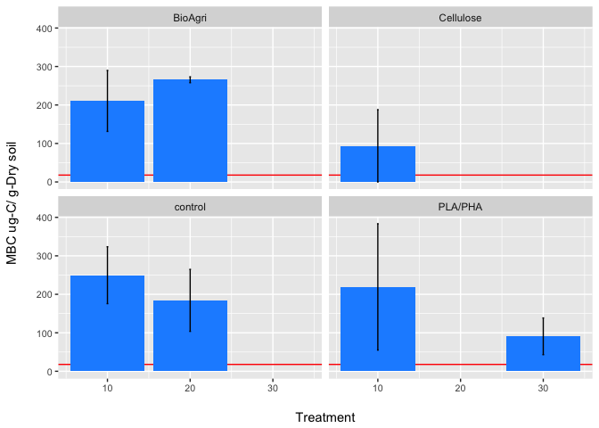

Experiment 1 figures
================
English
7/6/2017

Introduction
============

Plastic agricultural mulches provide weed control, moisture retention, temperature optimization, and decreased erosion. Because conventional mulches are composed of polyethylene, a poorly biodegradable plastic, they often end up in landfills after harvest. A more sustainable alternative is the use of biodegradable plastic mulches (BDMs) which, after being tilled into the soil subsequent to service life, degrade into carbon dioxide, water, and soil organic matter.

However, the role of temperature in the biodegradation of these materials is not well known. We conducted a manipulative incubation experiment to look at in situ biodegradability of a mulch films: a starch/polyester blend (BioAgri). They were kept at different temperatures (10, 20, and 30°C) and the evolution of CO2 was measured biweekly over 16 weeks to monitor the time course of biodegradation. The influence of temperature on the rate of degradation for biodegradable mulches could help determine the impact of climate and environment on microbial assimilation.

Methods
=======

CO2 evolution was measured every 2 weeks by sampling the headspace and measuring CO2 concentration on an infrared gas analyzer. At t=0 and t=16 weeks total organic carbon (TOC) and bulk soil carbon isotopic signature were measured using Cavity Ring-Down Spectroscopy and microbial biomass and EOC were measured using the chloroform extraction method.

Results
=======

   

### DOC

| Mulch     |  Temp|          avg|    n|           sd|          se|        ymax|        ymin|
|:----------|-----:|------------:|----:|------------:|-----------:|-----------:|-----------:|
| BioAgri   |    10|    21.329997|    4|    12.050057|    6.025029|    27.35503|   15.304968|
| BioAgri   |    20|    10.869680|    4|     3.619818|    1.809909|    12.67959|    9.059771|
| BioAgri   |    30|    22.971970|    4|    21.659838|   10.829919|    33.80189|   12.142051|
| Cellulose |    10|   331.270346|    4|   219.585732|  109.792866|   441.06321|  221.477480|
| Cellulose |    20|   315.677698|    4|    67.088294|   33.544147|   349.22184|  282.133551|
| Cellulose |    30|  1048.434299|    4|  1124.692231|  562.346115|  1610.78041|  486.088184|
| control   |    10|     8.659963|    4|     2.960155|    1.480078|    10.14004|    7.179885|
| control   |    20|    77.302750|    4|   134.110514|   67.055257|   144.35801|   10.247493|
| control   |    30|   477.471743|    4|   418.806071|  209.403036|   686.87478|  268.068707|
| PLA/PHA   |    10|    22.890502|    4|    12.281530|    6.140765|    29.03127|   16.749737|
| PLA/PHA   |    20|    13.923234|    4|     5.727440|    2.863720|    16.78695|   11.059514|
| PLA/PHA   |    30|    17.306598|    4|    10.183947|    5.091973|    22.39857|   12.214624|

    

### MBC

| Mulch     |  Temp|        avg|    n|           sd|          se|        ymax|         ymin|
|:----------|-----:|----------:|----:|------------:|-----------:|-----------:|------------:|
| BioAgri   |    10|   210.5700|    4|   158.620275|   79.310137|   289.88014|    131.25986|
| BioAgri   |    20|   265.5825|    4|    15.398659|    7.699329|   273.28183|    257.88317|
| BioAgri   |    30|   518.0750|    4|   505.824090|  252.912045|   770.98705|    265.16295|
| Cellulose |    10|   -84.1750|    4|   343.899795|  171.949898|    87.77490|   -256.12490|
| Cellulose |    20|   707.4425|    4|  1041.984551|  520.992275|  1228.43478|    186.45022|
| Cellulose |    30|  -952.4200|    4|  1098.719150|  549.359575|  -403.06043|  -1501.77957|
| control   |    10|   249.7200|    4|   147.991458|   73.995729|   323.71573|    175.72427|
| control   |    20|   184.2700|    4|   161.212687|   80.606343|   264.87634|    103.66366|
| control   |    30|  -253.5600|    4|   387.448100|  193.724050|   -59.83595|   -447.28405|
| PLA/PHA   |    10|   219.2575|    4|   328.324290|  164.162145|   383.41964|     55.09536|
| PLA/PHA   |    20|    17.4600|    4|     7.590929|    3.795464|    21.25546|     13.66454|
| PLA/PHA   |    30|    90.8625|    4|    95.445373|   47.722687|   138.58519|     43.13981|

    

### TOC

| Mulch     | Temp |       avg|    n|         sd|         se|      ymax|      ymin|
|:----------|:-----|---------:|----:|----------:|----------:|---------:|---------:|
| BioAgri   | 10   |  5.383865|    4|  0.0898372|  0.0449186|  5.428784|  5.338947|
| BioAgri   | 20   |  5.763879|    4|  0.1459596|  0.0729798|  5.836859|  5.690900|
| BioAgri   | 30   |  5.229424|    4|  0.2167898|  0.1083949|  5.337819|  5.121029|
| Cellulose | 10   |  5.326440|    4|  0.2816027|  0.1408013|  5.467241|  5.185639|
| Cellulose | 20   |  6.462344|    4|  0.2075456|  0.1037728|  6.566117|  6.358571|
| Cellulose | 30   |  5.284737|    4|  0.1259033|  0.0629516|  5.347688|  5.221785|
| No mulch  | 10   |  5.606395|    4|  0.1606720|  0.0803360|  5.686731|  5.526059|
| No mulch  | 20   |  5.102144|    4|  0.1184948|  0.0592474|  5.161391|  5.042896|
| No mulch  | 30   |  5.435096|    4|  0.2222747|  0.1111373|  5.546233|  5.323959|
| PLA/PHA   | 10   |  5.372261|    4|  0.2585424|  0.1292712|  5.501533|  5.242990|
| PLA/PHA   | 20   |  5.711406|    4|  0.4965546|  0.2482773|  5.959684|  5.463129|
| PLA/PHA   | 30   |  5.561832|    4|  0.1693192|  0.0846596|  5.646492|  5.477173|

    

### d13C

| Mulch     | Temp |        avg|    n|         sd|         se|       ymax|       ymin|
|:----------|:-----|----------:|----:|----------:|----------:|----------:|----------:|
| BioAgri   | 10   |  -24.72913|    4|  0.1444826|  0.0722413|  -24.65689|  -24.80137|
| BioAgri   | 20   |  -23.17260|    4|  0.0246334|  0.0123167|  -23.16028|  -23.18492|
| BioAgri   | 30   |  -23.04323|    4|  0.3387297|  0.1693649|  -22.87387|  -23.21259|
| Cellulose | 10   |  -24.40125|    4|  0.2494836|  0.1247418|  -24.27650|  -24.52599|
| Cellulose | 20   |  -23.44207|    4|  0.1679288|  0.0839644|  -23.35811|  -23.52604|
| Cellulose | 30   |  -23.29557|    4|  0.2239447|  0.1119724|  -23.18360|  -23.40754|
| No mulch  | 10   |  -25.22838|    4|  0.4031065|  0.2015533|  -25.02682|  -25.42993|
| No mulch  | 20   |  -22.47217|    4|  0.3185702|  0.1592851|  -22.31289|  -22.63146|
| No mulch  | 30   |  -23.09324|    4|  0.2901535|  0.1450767|  -22.94816|  -23.23832|
| PLA/PHA   | 10   |  -24.47451|    4|  0.2030505|  0.1015253|  -24.37298|  -24.57604|
| PLA/PHA   | 20   |  -23.04041|    4|  0.5322556|  0.2661278|  -22.77428|  -23.30653|
| PLA/PHA   | 30   |  -23.27577|    4|  0.4311978|  0.2155989|  -23.06017|  -23.49137|

   

### CO2 respiration

    

### Enzymes

