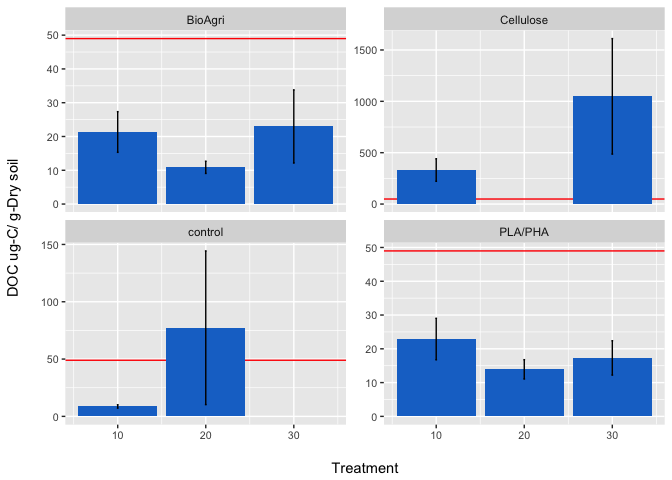

Experiment 1 figures
================
English
7/14/2017

Introduction
============

Plastic agricultural mulches provide weed control, moisture retention, temperature optimization, and decreased erosion. Because conventional mulches are composed of polyethylene, a poorly biodegradable plastic, they often end up in landfills after harvest. A more sustainable alternative is the use of biodegradable plastic mulches (BDMs) which, after being tilled into the soil subsequent to service life, degrade into carbon dioxide, water, and soil organic matter.

However, the role of temperature in the biodegradation of these materials is not well known. We conducted a manipulative incubation experiment to look at in situ biodegradability of a mulch films: a starch/polyester blend (BioAgri). They were kept at different temperatures (10, 20, and 30°C) and the evolution of CO2 was measured biweekly over 16 weeks to monitor the time course of biodegradation. The influence of temperature on the rate of degradation for biodegradable mulches could help determine the impact of climate and environment on microbial assimilation.

### Importance

-   Composition of the mulches - quality of the carbon addition and how this affects its temp. sensitivity
-   Mulch materials have some effect on the temperature sensitivity of microbial metabolism
-   Important to limit residuals of plastics, what temperature is needed to prevent this (Brodhagen, 2016)
-   USDA recommends N additions when using organic mulche covers, however they do not take into account temperature sensitivies of the mulches.

Methods
=======

CO2 evolution was measured every 2 weeks by sampling the headspace and measuring CO2 concentration on an infrared gas analyzer. At t=0 and t=16 weeks total organic carbon (TOC) and bulk soil carbon isotopic signature were measured using Cavity Ring-Down Spectroscopy and microbial biomass and EOC were measured using the chloroform extraction method.

Results
=======

### DOC

-   Red line = DOC at t=0
-   Axes are free to vary because large range
-   BioAgri and PLA/PHA saw a decrease in DOC over 16 weeks
-   More DOC, peptides, and carbs formed from high-quality litter. Most low-quality litter (BioAgri and PLA/PHA) lost as CO2 (Cotrufo, MEMS)
-   No temperature sensitivity (maybe in control and cellulose)
-   Cellulose has much higher DOC than all other treatments

    

### MBC

-   Red line = MBC at t=0
-   Axes are all the same
-   MBC increased over the 16 weeks for all treatments
-   Large standard errors
-   30-35% of decomposed C becomes biomass, 2/3 lost to CO2

    

   

### TOC

-   Change in TOC after 16 weeks

### Cumulative CO2 produced

-   PLA/PHA: 117 mgC mulch added / 100g soil = 1.17 mg C/gdry soil
-   BioAgri: 142 mgC mulch added / 100g soil = 1.42 mg C/gdry soil
-   Cellulose: 112 mgC mulch added / 100g soil = 1.12 mg C/gdry soil
-   Problem: CO2 respired does not include all soil carbon lost (is this an underestimate?)
-   Subtract the control from these graphs or leave it to compare to TOC graph

   

### CO2 respiration

-   All mulches have greater respiration than the no mulch control except for PLA/PHA at 10C
-   Fierer 2005: Litter decomposition becomes more sensitive to temperature as litter organic C declines (Carbon loss as CO2 ranged from 16-52% of initial litter C)

    

### Q10 values

-   Mulches are more sensitive to the temperature change from 10C to 20C than the increase from 20C to 30C
-   Help to understand the minimum temperature for performance of these mulches
-   Q10 of microbial decomposition can vary by up to 40% depending on litter type
-   Inverse relation between litter quality and Q10 of decomposition: "C quality-temp" hypothesis

| Date    | Mulch     | Length |  Q10 (10-20)|  Q10 (20-30)|  Q10 (10-30)|  Average|
|:--------|:----------|:-------|------------:|------------:|------------:|--------:|
| 6/7/16  | BioAgri   | Full   |         2.39|         1.56|         1.93|     1.96|
| 6/7/16  | Control   | Full   |         2.57|         1.42|         1.91|     1.97|
| 6/7/16  | PLA/PHA   | Full   |         3.08|         1.86|         2.40|     2.45|
| 6/7/16  | Cellulose | Full   |         3.11|         1.67|         2.28|     2.35|
| 4/12/16 | BioAgri   | Half   |         2.40|         1.78|         2.06|     2.08|
| 4/12/16 | Control   | Half   |         2.30|         1.50|         1.86|     1.89|
| 4/12/16 | PLA/PHA   | Half   |         2.82|         1.72|         2.20|     2.24|
| 4/12/16 | Cellulose | Half   |         3.50|         2.10|         2.71|     2.77|

### Enzymes

-   Change in enzyme activity after 16 weeks
-   Phosphotase is temperature sensitive in BioAgri and Cellulose treatments
-   Nagase activity increases during cellulose decomposition because microbes become N limited
-   A decrease in enzyme activity after 16 weeks is the opposite of what would be expected for this experiment.
-   Was Vmax achieved, are we out of enzymes because there is too much substrate?
-   Priming: CB increases
-   XYL: breaks down hemicellulose (plant wall)
-   BG: breaks down cellulose
-   Large decrease in all cellulose enzymes after 16 weeks because it is all gone

