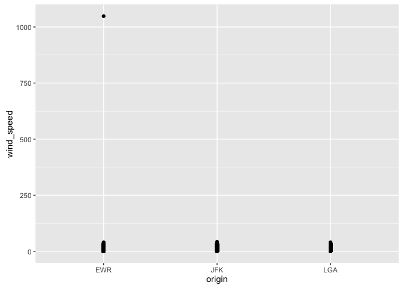
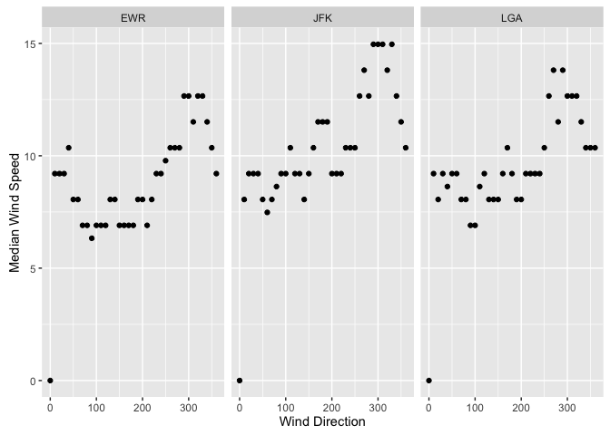
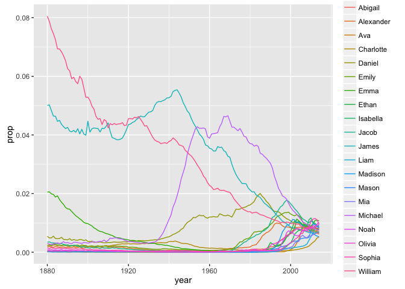
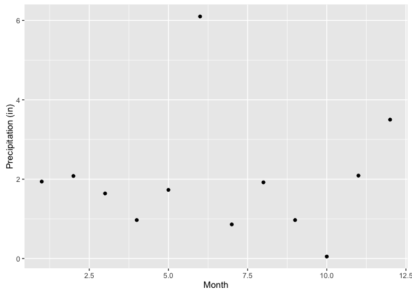

Task 7
================

Determine whether there are any clear outliers in wind speed (wind\_speed) that should be rejected. If so, filter those bad point(s) and proceed.

    ## # A tibble: 26,126 × 15
    ##    origin  year month   day  hour  temp  dewp humid wind_dir wind_speed
    ##     <chr> <dbl> <dbl> <int> <int> <dbl> <dbl> <dbl>    <dbl>      <dbl>
    ## 1     EWR  2013     1     1     0 37.04 21.92 53.97      230   10.35702
    ## 2     EWR  2013     1     1     1 37.04 21.92 53.97      230   13.80936
    ## 3     EWR  2013     1     1     2 37.94 21.92 52.09      230   12.65858
    ## 4     EWR  2013     1     1     3 37.94 23.00 54.51      230   13.80936
    ## 5     EWR  2013     1     1     4 37.94 24.08 57.04      240   14.96014
    ## 6     EWR  2013     1     1     6 39.02 26.06 59.37      270   10.35702
    ## 7     EWR  2013     1     1     7 39.02 26.96 61.63      250    8.05546
    ## 8     EWR  2013     1     1     8 39.02 28.04 64.43      240   11.50780
    ## 9     EWR  2013     1     1     9 39.92 28.04 62.21      250   12.65858
    ## 10    EWR  2013     1     1    10 39.02 28.04 64.43      260   12.65858
    ## # ... with 26,116 more rows, and 5 more variables: wind_gust <dbl>,
    ## #   precip <dbl>, pressure <dbl>, visib <dbl>, time_hour <dttm>

What direction has the highest median speed at each airport? Make a table and a plot of median wind speed by direction, for each airport.

    ## Source: local data frame [114 x 3]
    ## Groups: origin [?]
    ## 
    ##    origin wind_dir medianwind
    ##     <chr>    <dbl>      <dbl>
    ## 1     EWR        0    0.00000
    ## 2     EWR       10    9.20624
    ## 3     EWR       20    9.20624
    ## 4     EWR       30    9.20624
    ## 5     EWR       40   10.35702
    ## 6     EWR       50    8.05546
    ## 7     EWR       60    8.05546
    ## 8     EWR       70    6.90468
    ## 9     EWR       80    6.90468
    ## 10    EWR       90    6.32929
    ## # ... with 104 more rows

    ## Source: local data frame [10 x 3]
    ## Groups: origin [3]
    ## 
    ##    origin wind_dir medianwind
    ##     <chr>    <dbl>      <dbl>
    ## 1     EWR      290   12.65858
    ## 2     EWR      300   12.65858
    ## 3     EWR      320   12.65858
    ## 4     EWR      330   12.65858
    ## 5     JFK      290   14.96014
    ## 6     JFK      300   14.96014
    ## 7     JFK      310   14.96014
    ## 8     JFK      330   14.96014
    ## 9     LGA      270   13.80936
    ## 10    LGA      290   13.80936

Make a table average distance from JFK for each Airline

    ## # A tibble: 10 × 2
    ##                        name       avg
    ##                       <chr>     <dbl>
    ## 1    Hawaiian Airlines Inc. 4983.0000
    ## 2     United Air Lines Inc. 2535.5922
    ## 3            Virgin America 2495.1196
    ## 4      Delta Air Lines Inc. 1689.3074
    ## 5    American Airlines Inc. 1660.8528
    ## 6           US Airways Inc. 1127.4407
    ## 7           JetBlue Airways 1113.6737
    ## 8         Endeavor Air Inc.  506.8903
    ## 9                 Envoy Air  401.4698
    ## 10 ExpressJet Airlines Inc.  228.8303

Wide-frame data-set: Make a wide-format data frame that displays the number of flights that leave Newark ("EWR") airport each month, from each airline

    ## Source: local data frame [12 x 13]
    ## Groups: name [12]
    ## 
    ##                        name   `1`   `2`   `3`   `4`   `5`   `6`   `7`
    ## *                     <chr> <int> <int> <int> <int> <int> <int> <int>
    ## 1         Endeavor Air Inc.  4171  4023  3953  3879  3879  3867  3879
    ## 2    American Airlines Inc.  1895  1895  1895  1895  1895  1895  1895
    ## 3      Alaska Airlines Inc.    11    11    11    21    21    21    15
    ## 4           JetBlue Airways   507   380   507   380   517   517    27
    ## 5      Delta Air Lines Inc.   575   575   575   575   575   575   807
    ## 6  ExpressJet Airlines Inc.  4626  4201  4911  4603  4196  4160  4372
    ## 7                 Envoy Air  3768  3737  3768  3768  3768  3768  3267
    ## 8     SkyWest Airlines Inc.    NA    NA    NA    NA    NA  4528    NA
    ## 9     United Air Lines Inc.  1545  1018   475  1545  1622  1686   332
    ## 10          US Airways Inc.   245  1117  1117  1843  1219  1431  1431
    ## 11           Virgin America    NA    NA    NA   193   183   183   183
    ## 12   Southwest Airlines Co.  3848  3839   815  1972   433  2213   488
    ## # ... with 5 more variables: `8` <int>, `9` <int>, `10` <int>, `11` <int>,
    ## #   `12` <int>

Identify the ten most common male and female names in 2014.

    ## Source: local data frame [20 x 2]
    ## Groups: sex [2]
    ## 
    ##         name   sex
    ##        <chr> <chr>
    ## 1       Emma     F
    ## 2     Olivia     F
    ## 3     Sophia     F
    ## 4   Isabella     F
    ## 5        Ava     F
    ## 6        Mia     F
    ## 7      Emily     F
    ## 8    Abigail     F
    ## 9    Madison     F
    ## 10 Charlotte     F
    ## 11      Noah     M
    ## 12      Liam     M
    ## 13     Mason     M
    ## 14     Jacob     M
    ## 15   William     M
    ## 16     Ethan     M
    ## 17   Michael     M
    ## 18 Alexander     M
    ## 19     James     M
    ## 20    Daniel     M

Make a single table of the 26th through 29th most common girls names in the year 1896, 1942, and 2016

    ## # A tibble: 4 × 2
    ##    year    name
    ##   <dbl>   <chr>
    ## 1  1896  Martha
    ## 2  1896  Esther
    ## 3  1896 Frances
    ## 4  1896   Edith

    ## # A tibble: 4 × 2
    ##    year    name
    ##   <dbl>   <chr>
    ## 1  1942   Helen
    ## 2  1942 Marilyn
    ## 3  1942   Diane
    ## 4  1942  Martha

    ## # A tibble: 4 × 2
    ##    year     name
    ##   <dbl>    <chr>
    ## 1  2014 Brooklyn
    ## 2  2014     Lily
    ## 3  2014   Hannah
    ## 4  2014    Layla

    ## # A tibble: 4 × 6
    ##    year     name  year    name  year    name
    ##   <dbl>    <chr> <dbl>   <chr> <dbl>   <chr>
    ## 1  2014 Brooklyn  1942   Helen  1896  Martha
    ## 2  2014     Lily  1942 Marilyn  1896  Esther
    ## 3  2014   Hannah  1942   Diane  1896 Frances
    ## 4  2014    Layla  1942  Martha  1896   Edith

1.  Create your own: Plot inches of rain per month at JFK airport

