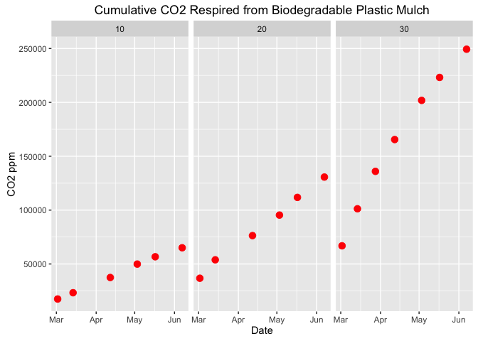

Decomposition measured by CO2 Evolution
================

**Introduction**

Plastic agricultural mulches provide weed control, moisture retention, temperature optimization, and decreased erosion. Because conventional mulches are composed of polyethylene, a poorly biodegradable plastic, they often end up in landfills after harvest. A more sustainable alternative is the use of biodegradable plastic mulches (BDMs) which, after being tilled into the soil subsequent to service life, degrade into carbon dioxide, water, and soil organic matter.

However, the role of temperature in the biodegradation of these materials is not well known. We conducted a manipulative incubation experiment to look at in situ biodegradability of a mulch films: a starch/polyester blend (BioAgri). They were kept at different temperatures (10, 20, and 30°C) and the evolution of CO2 was measured biweekly over 16 weeks to monitor the time course of biodegradation. Cumulative CO2 produced during the 30°C incubation was greater in the starch/polyester trials when compared to the no mulch control indicating microbial assimilation of the mulch. The influence of temperature on the rate of degradation for biodegradable mulches could help determine the impact of climate and environment on microbial assimilation.

**Methods**

CO2 evolution was measured every 2 weeks by sampling the headspace and measuring CO2 concentration on an infrared gas analyzer. At t=0 and t=16 weeks total organic carbon (TOC) and bulk soil carbon isotopic signature were measured using Cavity Ring-Down Spectroscopy and microbial biomass and EOC were measured using the chloroform extraction method.

**Results**

**Discussion**

At 30°C, all the jar incubations with mulch had higher CO2 evolved than the 10°C or 20°C incubations indicating the rate of microbial assimilation of the mulches is increased at higher temperatures. In future studies, it would be interesting to measure the d13C of the mulches to see if the increased CO2 at higher temperatures is from SOM or from the mulch material. There may be priming occuring which could be uncovered by tracing the isotopic values of the CO2 evolved.
