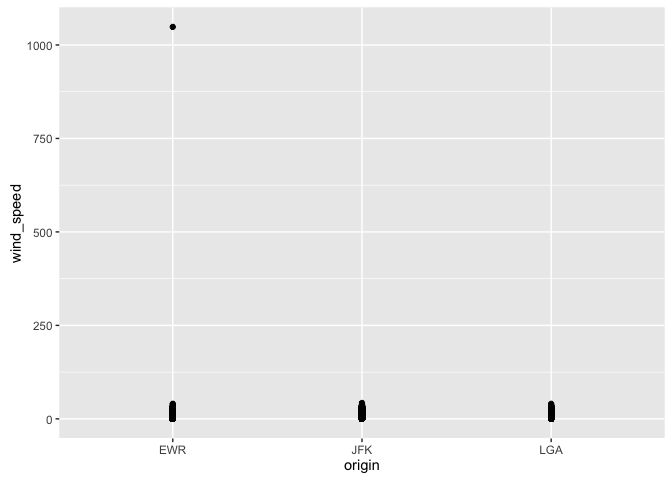
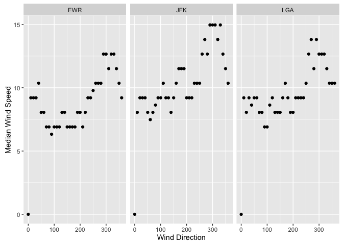
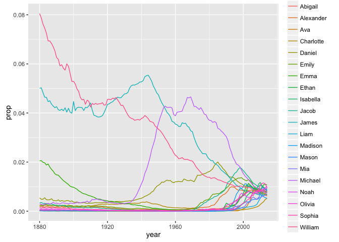
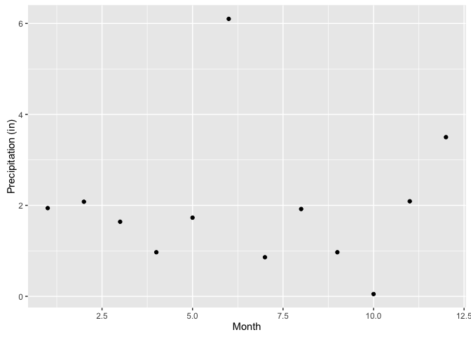

Task 7
================

Determine whether there are any clear outliers in wind speed (wind\_speed) that should be rejected. If so, filter those bad point(s) and proceed.

``` r
#Create a chart to see spread of wind_speed

outliers_ws<- nycflights13::weather %>%
  group_by (origin)  %>%
  ggplot (aes(origin, wind_speed)) + 
  geom_point ()
print (outliers_ws)
```



``` r
#Create a dataframe where wind speeds greater than 250 mph are removed 

nycflights2<- nycflights13::weather %>%
  filter (wind_speed < 250)
print (nycflights2)
```

    ## # A tibble: 26,126 × 15
    ##    origin  year month   day  hour  temp  dewp humid wind_dir wind_speed
    ##     <chr> <dbl> <dbl> <int> <int> <dbl> <dbl> <dbl>    <dbl>      <dbl>
    ## 1     EWR  2013     1     1     0 37.04 21.92 53.97      230   10.35702
    ## 2     EWR  2013     1     1     1 37.04 21.92 53.97      230   13.80936
    ## 3     EWR  2013     1     1     2 37.94 21.92 52.09      230   12.65858
    ## 4     EWR  2013     1     1     3 37.94 23.00 54.51      230   13.80936
    ## 5     EWR  2013     1     1     4 37.94 24.08 57.04      240   14.96014
    ## 6     EWR  2013     1     1     6 39.02 26.06 59.37      270   10.35702
    ## 7     EWR  2013     1     1     7 39.02 26.96 61.63      250    8.05546
    ## 8     EWR  2013     1     1     8 39.02 28.04 64.43      240   11.50780
    ## 9     EWR  2013     1     1     9 39.92 28.04 62.21      250   12.65858
    ## 10    EWR  2013     1     1    10 39.02 28.04 64.43      260   12.65858
    ## # ... with 26,116 more rows, and 5 more variables: wind_gust <dbl>,
    ## #   precip <dbl>, pressure <dbl>, visib <dbl>, time_hour <dttm>

``` r
#See how many points are removed: compare with weather, 4 outliers removed 
```

What direction has the highest median speed at each airport? Make a table and a plot of median wind speed by direction, for each airport.

``` r
#Table of median wind speed by direction, for earch airport 
median.ws<- nycflights2 %>%
  group_by (origin, wind_dir) %>%
  summarise (medianwind = (median(wind_speed, na.rm= TRUE)))
median.ws
```

    ## Source: local data frame [114 x 3]
    ## Groups: origin [?]
    ## 
    ##    origin wind_dir medianwind
    ##     <chr>    <dbl>      <dbl>
    ## 1     EWR        0    0.00000
    ## 2     EWR       10    9.20624
    ## 3     EWR       20    9.20624
    ## 4     EWR       30    9.20624
    ## 5     EWR       40   10.35702
    ## 6     EWR       50    8.05546
    ## 7     EWR       60    8.05546
    ## 8     EWR       70    6.90468
    ## 9     EWR       80    6.90468
    ## 10    EWR       90    6.32929
    ## # ... with 104 more rows

``` r
#Plot of median wind speed by direction, for earch airport 
plotws<-ggplot(median.ws, aes (wind_dir, medianwind)) + 
  geom_point() +
  facet_wrap(~origin) +
  ylab("Median Wind Speed")+ xlab("Wind Direction")
print (plotws)
```



``` r
#Directions of the highest median wind speeds at each airport: 
median.ws.max <- median.ws %>%
  filter (medianwind == max (medianwind))
median.ws.max
```

    ## Source: local data frame [10 x 3]
    ## Groups: origin [3]
    ## 
    ##    origin wind_dir medianwind
    ##     <chr>    <dbl>      <dbl>
    ## 1     EWR      290   12.65858
    ## 2     EWR      300   12.65858
    ## 3     EWR      320   12.65858
    ## 4     EWR      330   12.65858
    ## 5     JFK      290   14.96014
    ## 6     JFK      300   14.96014
    ## 7     JFK      310   14.96014
    ## 8     JFK      330   14.96014
    ## 9     LGA      270   13.80936
    ## 10    LGA      290   13.80936

Make a table average distance from JFK for each Airline

``` r
flights1<-nycflights13::flights %>%
  filter (origin == "JFK") %>%
  select (carrier, distance) %>%
  left_join (airlines, by= "carrier") %>%
  select (distance, name) %>%
  group_by (name)  %>%
  summarise (avg= mean(distance)) %>%
  arrange (desc(avg)) 
flights1
```

    ## # A tibble: 10 × 2
    ##                        name       avg
    ##                       <chr>     <dbl>
    ## 1    Hawaiian Airlines Inc. 4983.0000
    ## 2     United Air Lines Inc. 2535.5922
    ## 3            Virgin America 2495.1196
    ## 4      Delta Air Lines Inc. 1689.3074
    ## 5    American Airlines Inc. 1660.8528
    ## 6           US Airways Inc. 1127.4407
    ## 7           JetBlue Airways 1113.6737
    ## 8         Endeavor Air Inc.  506.8903
    ## 9                 Envoy Air  401.4698
    ## 10 ExpressJet Airlines Inc.  228.8303

Wide-frame data-set: Make a wide-format data frame that displays the number of flights that leave Newark ("EWR") airport each month, from each airline

``` r
flights2 <- nycflights13::flights %>%
  filter (origin == "EWR") %>%
  select (flight, month, carrier)  %>%
  left_join (airlines, by= "carrier") %>%
  group_by(month, name)  %>%
  summarise (num_fligths = length (flight)) %>%
  spread (month, num_fligths) 
flights2
```

    ## # A tibble: 12 × 13
    ##                        name   `1`   `2`   `3`   `4`   `5`   `6`   `7`
    ## *                     <chr> <int> <int> <int> <int> <int> <int> <int>
    ## 1      Alaska Airlines Inc.    62    56    62    60    62    60    62
    ## 2    American Airlines Inc.   298   268   295   288   297   291   303
    ## 3      Delta Air Lines Inc.   279   249   319   364   377   347   340
    ## 4         Endeavor Air Inc.    82    75    91    88   103    88    94
    ## 5                 Envoy Air   212   196   228   220   226   218   228
    ## 6  ExpressJet Airlines Inc.  3838  3480  3996  3870  4039  3661  3747
    ## 7           JetBlue Airways   573   532   612   567   517   506   546
    ## 8     SkyWest Airlines Inc.    NA    NA    NA    NA    NA     2    NA
    ## 9    Southwest Airlines Co.   529   490   532   518   530   501   526
    ## 10    United Air Lines Inc.  3657  3433  3913  4025  3874  3931  4046
    ## 11          US Airways Inc.   363   328   372   361   381   390   402
    ## 12           Virgin America    NA    NA    NA   170   186   180   181
    ## # ... with 5 more variables: `8` <int>, `9` <int>, `10` <int>, `11` <int>,
    ## #   `12` <int>

Identify the ten most common male and female names in 2014.

``` r
bbn1 <- babynames::babynames %>%
  filter (year == "2014")  %>%
  group_by (sex) %>%
  slice (1:10) %>%
  select (name,sex)
bbn1
```

    ## Source: local data frame [20 x 2]
    ## Groups: sex [2]
    ## 
    ##         name   sex
    ##        <chr> <chr>
    ## 1       Emma     F
    ## 2     Olivia     F
    ## 3     Sophia     F
    ## 4   Isabella     F
    ## 5        Ava     F
    ## 6        Mia     F
    ## 7      Emily     F
    ## 8    Abigail     F
    ## 9    Madison     F
    ## 10 Charlotte     F
    ## 11      Noah     M
    ## 12      Liam     M
    ## 13     Mason     M
    ## 14     Jacob     M
    ## 15   William     M
    ## 16     Ethan     M
    ## 17   Michael     M
    ## 18 Alexander     M
    ## 19     James     M
    ## 20    Daniel     M

``` r
# Make a plot of their frequency (prop) since 1880. 

bbn1_n<- inner_join(bbn1, babynames::babynames) %>%
  ggplot (aes (x= year, y= prop, colour = name)) + 
  geom_line () 

print (bbn1_n)
```



Make a single table of the 26th through 29th most common girls names in the year 1896, 1942, and 2016

``` r
bbn_1896 <- babynames::babynames %>%
  filter (year == 1896)  %>%
  filter (sex == "F") %>%
  arrange (desc(n)) %>%
  slice (26:29) %>%
  select (year,name) 
bbn_1896
```

    ## # A tibble: 4 × 2
    ##    year    name
    ##   <dbl>   <chr>
    ## 1  1896  Martha
    ## 2  1896  Esther
    ## 3  1896 Frances
    ## 4  1896   Edith

``` r
bbn_1942 <- babynames::babynames %>%
  filter (year == 1942)  %>%
  filter (sex == "F") %>%
  arrange (desc(n)) %>%
  slice (26:29) %>%
  select (year,name) 
bbn_1942
```

    ## # A tibble: 4 × 2
    ##    year    name
    ##   <dbl>   <chr>
    ## 1  1942   Helen
    ## 2  1942 Marilyn
    ## 3  1942   Diane
    ## 4  1942  Martha

``` r
bbn_2014 <- babynames::babynames %>%
  filter (year == 2014)  %>%
  filter (sex == "F") %>%
  arrange (desc(n)) %>%
  slice (26:29) %>%
  select (year,name) 
bbn_2014
```

    ## # A tibble: 4 × 2
    ##    year     name
    ##   <dbl>    <chr>
    ## 1  2014 Brooklyn
    ## 2  2014     Lily
    ## 3  2014   Hannah
    ## 4  2014    Layla

``` r
#combine the three years into one table
bbn_4names <- bbn_2014 %>%
  bind_cols (bbn_1942, bbn_1896)
bbn_4names
```

    ## # A tibble: 4 × 6
    ##    year     name  year    name  year    name
    ##   <dbl>    <chr> <dbl>   <chr> <dbl>   <chr>
    ## 1  2014 Brooklyn  1942   Helen  1896  Martha
    ## 2  2014     Lily  1942 Marilyn  1896  Esther
    ## 3  2014   Hannah  1942   Diane  1896 Frances
    ## 4  2014    Layla  1942  Martha  1896   Edith

Create your own: Plot inches of rain per month at JFK airport

``` r
rainydaysplot <- nycflights13::weather %>%
  filter (origin == "JFK") %>%
  select (year, month, day, hour, precip) %>%
  filter (precip > 0) %>%
  group_by (month)  %>%
  summarise (monthlyprecip= sum(precip))  %>%
  ggplot (aes(month, monthlyprecip)) +
  geom_point () +
  ylab("Precipitation (in)")+ xlab("Month")


print (rainydaysplot)
```


